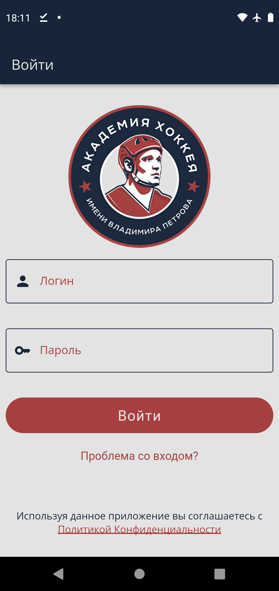
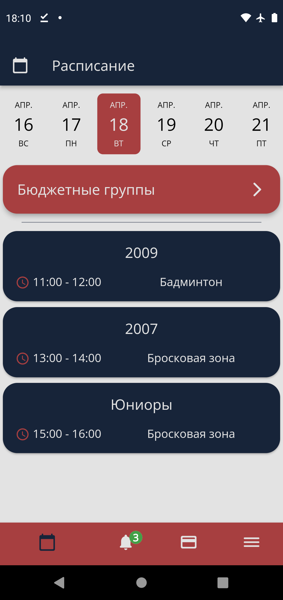
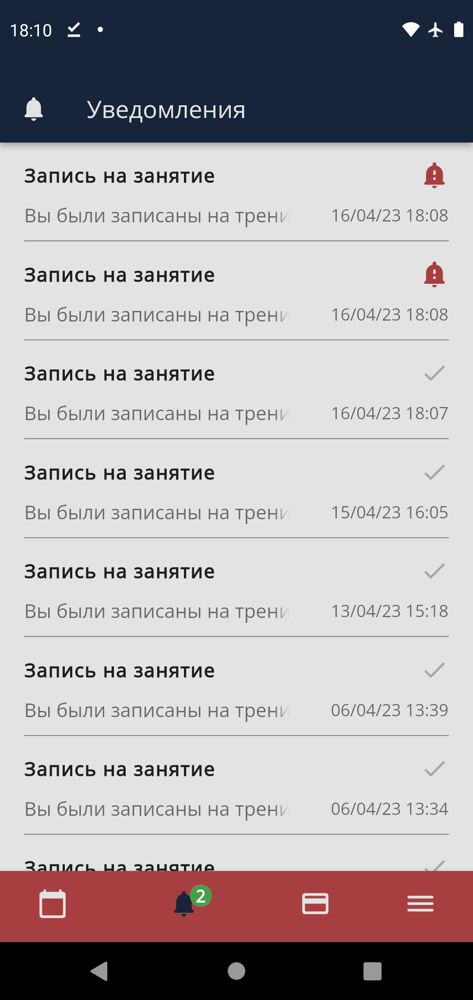
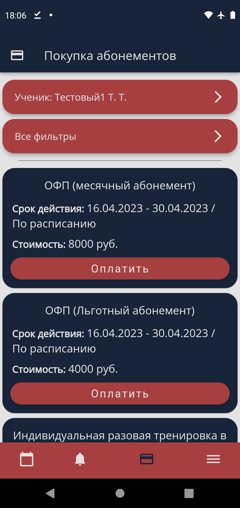
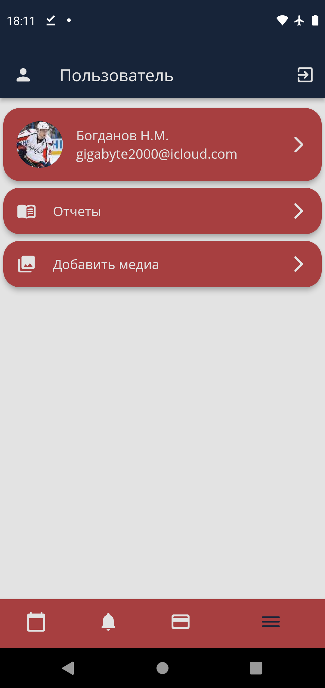
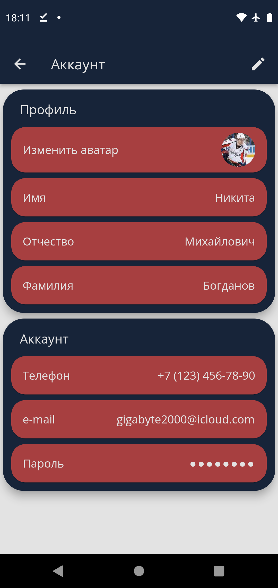
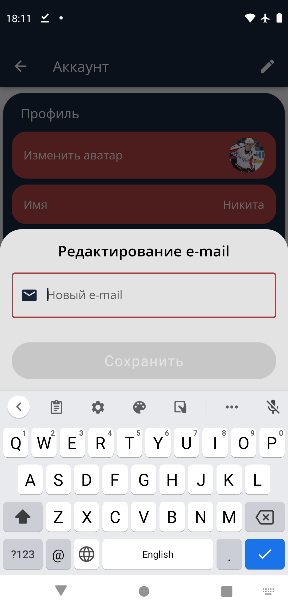
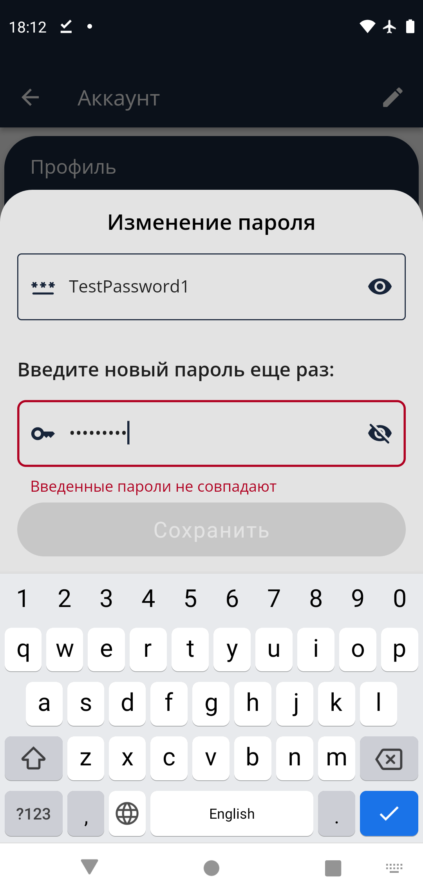
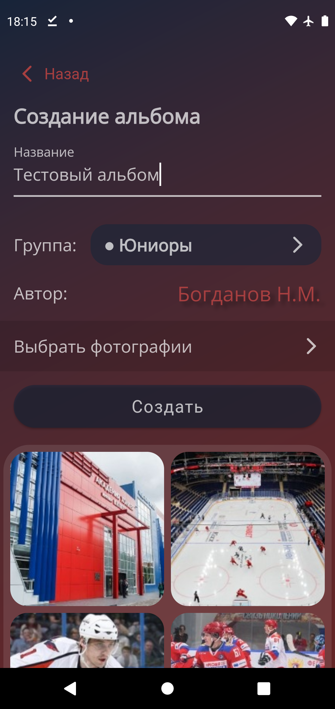

# Petrov Hockey Academy App

Приложение хоккейной акдемии им. Петрова с помощью котрого пользователи могут:
- Восстанавливать доступ к учетной записи по введенному e-mail
- Иметь доступ к расписанию тренировок (бюджетные/платные/индивидуальные)
- Записываться на индивидуальные тренировки
- Получать уведолмения и просматривать историю уведомлений за все время
- Покупать абонементы на тренировки
- Редактировать пользовательские данные, в том числе пароль 
- Просматривать отчеты об оплатах и посещений тренировок за все время
- Если пользователь является редактором медиа:
    - Просматривать список уже отправленных на публикацию альбомов и видео
    - Отправлять администрации сайта академии альбому и видео на публикацию (если пользователь является редактором медиа)

## Пакеты

[bloc](https://pub.dev/packages/bloc) /  [flutter_bloc](https://pub.dev/packages/flutter_bloc)

[bloc_concurrency](https://pub.dev/packages/bloc_concurrency)

[firebase_messaging](https://pub.dev/packages/firebase_messaging)

[formz](https://pub.dev/packages/formz)

[equatable](https://pub.dev/packages/equatable)

[graphql_flutter](https://pub.dev/packages/graphql_flutter)

[get_it](https://pub.dev/packages/get_it)

[wechat_assets_picker](https://pub.dev/packages/wechat_assets_picker)

[connectivity_plus](https://pub.dev/packages/connectivity_plus)

[shimmer](https://pub.dev/packages/shimmer/example)

## Screenshots

